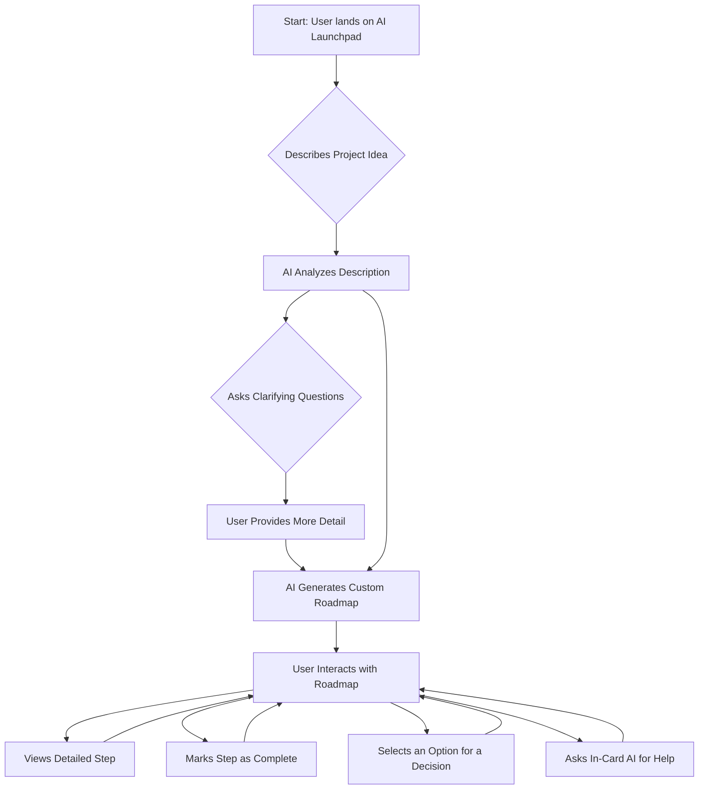

# AI Studio Launch Assistant

The AI Studio Launch Assistant is an interactive, AI-powered web application designed to guide developers through the entire lifecycle of creating and deploying a modern web application, with a special focus on projects utilizing Google's Gemini API. It acts as an expert project manager and architect, providing a customized roadmap, detailed guidance, and a suite of intelligent tools to accelerate development and ensure best practices.

## 🚀 Product Requirements Document (PRD)

### 1. Introduction & Goal
The primary goal of the AI Studio Launch Assistant is to demystify the process of going from a prototype to a production-ready application. It streamlines development by generating a personalized, step-by-step deployment plan based on a user's project description. This ensures that critical aspects like security, infrastructure, and deployment are considered from the outset, reducing common pitfalls and accelerating the path to launch.

### 2. Target Audience
This tool is designed for frontend and full-stack developers, ranging from hobbyists to professionals, who are building applications on top of the Gemini API. It is especially useful for those who want a structured, secure, and efficient workflow for deploying on Google Cloud Platform (GCP) and Firebase.

### 3. Key Features
- **AI-Powered Roadmap Generation:** Users describe their project in natural language, and the AI generates a customized, step-by-step deployment roadmap.
- **Interactive Guidance & Checklists:** The roadmap consists of detailed, actionable cards for each step, covering everything from GCP setup to frontend hosting and CI/CD.
- **Contextual AI Chat:** Each step includes an in-card AI assistant that can clarify instructions, provide code examples, and even suggest new steps to add to the plan.
- **Integrated Developer Tools:** A suite of helper tools to automate common tasks:
    - **PRD & MVP Scoper:** Generates formal project documents and helps define the minimum viable product.
    - **Mermaid Diagram Builder:** Visualizes system architecture or user flows from a text description.
    - **GitHub Assistant:** Generates `.gitignore` files, suggests branch names, and creates Pull Request templates.
    - **Live Code Sandbox:** An environment to experiment with HTML/CSS/JS and generate simple app skeletons with AI.
- **Security-First Approach:** A prominent, critical security checklist ensures that API keys are handled safely and common vulnerabilities are addressed before deployment.
- **State Persistence:** The entire project plan, including progress and decisions, is saved in the browser's local storage, allowing users to pick up where they left off.

### 4. Technical Considerations
The application is a pure frontend application built with TypeScript, HTML, and CSS. It utilizes the `@google/genai` SDK directly from the client-side to power its AI features. It has no backend and relies entirely on local storage for state management.

### 5. Success Metrics
- High rate of successful plan generation from user prompts.
- User engagement with interactive elements (completing steps, using in-card chat).
- Frequent and successful use of the integrated developer tools.
- Positive user feedback regarding the clarity, accuracy, and usefulness of the generated roadmaps.

---

## ✨ Minimum Viable Product (MVP) Features

The core features required to validate the product's primary hypothesis were:
-   ✅ Core AI-driven plan generation from a user's text description.
-   ✅ Display of the generated plan as a list of detailed, expandable cards.
-   ✅ The ability for a user to mark steps as complete to track progress.
-   ✅ A static, non-interactive version of the core Deployment Guide content.
-   ✅ Basic state persistence in local storage to save a single plan.

---

## 📊 Application Flow (Mermaid Diagram)

This diagram illustrates the primary user journey through the application.

---

## 🔮 Future Plans & Roadmap

While the current tool is powerful, we have exciting plans for future enhancements:

-   **Full GitHub Integration:** Move beyond generating text to directly creating commits, pushing files (like `.gitignore`), and opening pull requests in a user's connected repository.
-   **Backend & Cloud Persistence:** Replace local storage with a secure backend (e.g., Firestore) to allow users to save, access, and manage their plans across multiple devices.
-   **User Authentication:** Implement user accounts (e.g., via Firebase Authentication) to support multiple project plans and personalization.
-   **Team Collaboration Features:** Introduce functionality for teams to share, view, and collaborate on a single launch plan in real-time.
-   **Deeper GCP Integration:** Generate `gcloud` CLI commands and provide direct, pre-configured links to the correct pages in the Google Cloud Console to perform required actions.
-   **Template Library:** Create a library of pre-built plan templates for common application types, such as "Chatbot with RAG," "Image Generation App," or "Serverless API."
